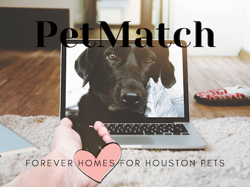

# PetMatch app

* Purpose of the app:

* How to use:

* Features on the app:

## Site Preview

## Live Link

[PetMatch live link](https://serene-mountain-01139.herokuapp.com/home)

## This site was built by:

* [Rickelle Tackitt](https://github.com/RickelleDawn)
* [Hannah Lima](https://github.com/#)
* [Keith Willis](https://github.com/WillisK-0)
* [Amy Roy](https://github.com/MeerKatnip)

## Database and API used:

* This project was built with [Amazon RDS](https://aws.amazon.com/rds/) and deployed on [Heroku](https://www.heroku.com/)
* The API used for this project was [PetFinder API](https://www.petfinder.com/developers/)

## Language and Frameworks used:

JavaScript, PostgreSQL, Sequelize, Node.js, Mustache, Bootstrap, bcrypt, EXPRESS, HTML, CSS